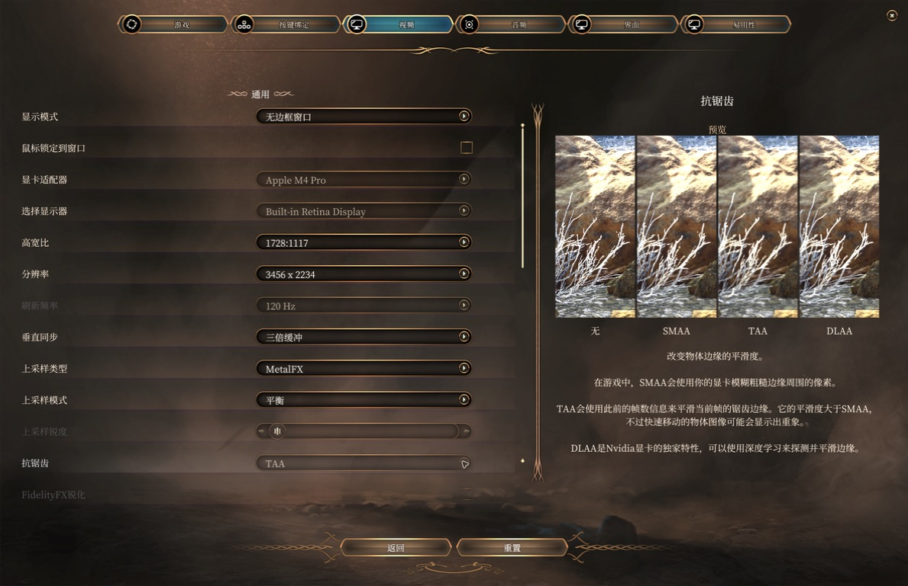
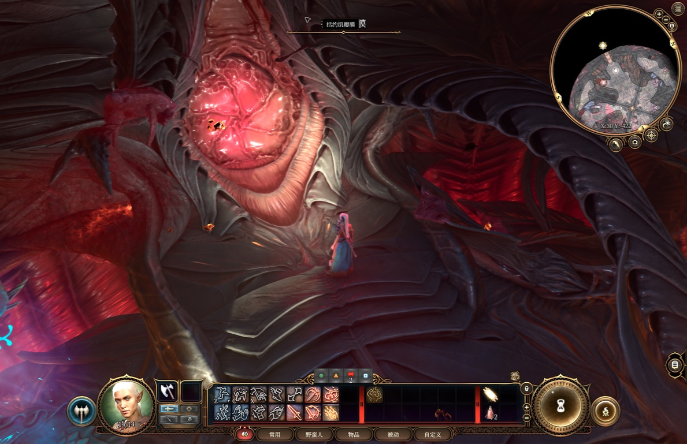

# BG3 MetalFX for macOS

<p align="center">
  <a href="README.md">English</a> |
  <a href="README.zh-CN.md">简体中文</a>
</p>

为 macOS Steam 版《博德之门 3》（AppID 1086940）加入原生 [MetalFX Temporal](https://developer.apple.com/documentation/metalfx) 时域超分。它使用游戏的当前帧 HDR 颜色、运动矢量、深度与相机抖动，以 Apple 的时域重建替换 FSR 1.0 的空间放大。

选择 **选项 → 视频 → 上采样类型 → MetalFX**。mod 会自动应用 **TAA**，将**上采样锐度设为 0**，并在 MetalFX 开启时将这两个控件灰显锁定。名称与说明由覆盖游戏全部 15 种语言的本地化 mod 提供；简繁中文的上采样标签与说明也已校正。注入通过 Steam 启动选项实现，不修改游戏 app 或存档。

当前参考测试：Apple M4 Pro、macOS 27、原生 arm64 Steam 版本 **4.1.1.7398727**。在连接电源、3456 × 2234、高画质并解除 10 FPS 上限的条件下，已完成同一真实存档中原生 TAA 与 MetalFX 四档的帧率对照。测试覆盖及限制见[验证记录](docs/VALIDATION.md)。

<p align="center">
  
  <br>
  <em>游戏原有视频设置中的 MetalFX 选项与本地化说明。</em>
</p>

<p align="center">
  
  <br>
  <em>真实存档中的性能档：从 1175 × 759 重建至 3456 × 2234。</em>
</p>

> **说明：** 安装包仅包含兼容性修复。你需要在 Steam 上拥有《博德之门 3》；本仓库不包含或分发游戏本体。

## 系统要求

- 支持 MetalFX Temporal 的 Apple Silicon Mac（arm64），macOS 13 或更新版本。目前仅在上述参考设备上实测。
- 原生 macOS Steam 版《博德之门 3》，版本 4.1.1.7398727。
- 至少启动一次游戏以生成 Steam 与玩家配置；安装或卸载前退出**游戏和 Steam**。
- MetalFX 使用游戏的 TAA 阶段及其相机抖动；TAA 会自动应用，无需手动设置抗锯齿。

## 一键安装

从 [GitHub Releases](https://github.com/noahhhi/BG3-MetalFX-macOS-support/releases/latest) 下载 **`BG3-MetalFX-arm64.pkg`** 并双击。安装器将注入器、启动包装器和卸载器放入 `~/Library/Application Support/BG3MetalFX/`，将 `BG3MetalFX.pak` 放入用户 Mods 目录，在已有玩家配置中注册 mod，并仅更新《博德之门 3》的 Steam 启动选项。

重新打开 Steam，照常启动游戏，选择 **MetalFX**，TAA 与零上采样锐度会自动强制应用。加载已有存档时，游戏可能提示启用新增的 BG3MetalFX mod；该本地化 mod 不包含玩法改动。

ZIP 是便携备用方案：解压 **`BG3-MetalFX-arm64.zip`** 后双击 **`Install BG3 MetalFX.command`**，或在解压目录执行 `bash install.sh`。两种方式使用同一个原生安装器，用户无需安装 Python、CMake 或 Xcode。

安装器保留已有启动参数和其他 mod。配置文件无效时，在写入前停止安装。恢复备份保存在 `~/Library/Application Support/BG3MetalFX-backup/`。其中包含原配置，请勿公开上传。

> [!IMPORTANT]
> PKG 尚未签名，二进制采用 ad-hoc 签名。如被 macOS 拦截，请在 **系统设置 → 隐私与安全性** 中允许安装；无需关闭 Gatekeeper 或降低系统安全性。

如果 PKG 提示安装失败，以下命令会在桌面生成 `BG3MF-install-log.txt`。请检查内容后再附到 [GitHub issue](https://github.com/noahhhi/BG3-MetalFX-macOS-support/issues)。

```sh
/usr/bin/grep -iE 'BG3 MetalFX|bg3mf|postinstall|error' /var/log/install.log | /usr/bin/tail -n 200 > "$HOME/Desktop/BG3MF-install-log.txt"
```

## 各档位渲染比例

| 上采样模式 | 每轴渲染比例 | 放大倍率 | 3456 × 2234 输出下实测输入 |
|---|---|---|---|
| 极高品质 | 约 67% | 1.5× | 2304 × 1489 |
| 品质 | 约 59% | 1.7× | 2032 × 1314 |
| 平衡 | 50% | 2.0× | 1728 × 1117 |
| 性能 | 约 34% | 2.94× | 1175 × 759 |

这些是本 mod 选定的比例，比游戏原版 FSR 1.0 同名档位各降低一级，实际尺寸由游戏取整。如果修改视频选项后渲染目标未重建，请重启游戏。

上采样类型为 **关** 时，恢复游戏原有渲染与抗锯齿路径。抗锯齿菜单重新可编辑；选择 **TAA** 即为原生分辨率的 TAA 对照。

## 工作原理

- Steam 启动包装器通过 `DYLD_INSERT_LIBRARIES` 加载注入器，保留 Steam 自身的覆盖层注入与已有启动参数。
- 在 TAA 阶段取得尚未经时间滤波的当前 HDR 颜色、运动矢量、转换为 R32Float 的设备深度，以及 jitter。MetalFX 在该 render encoder 结束后编码。
- 到达 EASU 时，compute kernel 将重建后的 HDR 颜色压缩并写入游戏原有中间纹理。工作在原 compute encoder 内完成，先于未改动的 RCAS 锐化／逆压缩和后续消费者。其他消费者仍可使用原 TAA，但其滤波结果不会送入 MetalFX。
- 检查映射地址与原值／指令后，仅在进程内存中修改 FSR 档位比例表及选项策略。启动游戏或切换档位时自动应用 TAA 与零上采样锐度，并使用游戏原有的控件禁用通知更新界面，不向磁盘打补丁。
- 标准 LSPK v18 mod 包含全部 15 种语言的名称／说明 XML 覆盖，并校正简繁中文的上采样标签和说明，遵循 [Larian 的本地化格式](https://docs.baldursgate3.game/index.php?title=Adding_Localisation)。

## 卸载

退出游戏和 Steam，运行 ZIP 中的 `uninstall.sh`，或下载 Release 中的独立卸载脚本：

```sh
bash ~/Downloads/uninstall.sh
```

脚本移除注入器、本地化 PAK 及 BG3MetalFX 自身的 mod 注册。当 BG3 启动选项仍与安装后的值一致时，恢复安装前的选项。其他游戏的启动选项、其他 mod，以及之后修改的无关配置都会保留。如果你在安装后编辑过 BG3 启动选项，卸载器会要求先移除包装器，避免覆盖你的修改。存档与恢复备份保留。

## 已知限制

- v1.0.0 存在黑屏与本地化加载缺陷，请使用 v1.0.1 或更新版本。
- 这是针对上述原生游戏版本的实验性注入。其他游戏版本、Intel/Rosetta、HDR 输出、分屏、多人联机及全部场景／特效尚未验证。
- MetalFX 开启时强制启用 TAA 阶段。MetalFX 读取该阶段滤波前的输入，不读取 TAA 已滤波的输出。本项目不提供帧生成或解锁成就的补丁，遵循游戏通常的 mod／玩家配置规则。
- 从原生渲染返回、缩放器尺寸／格式变化和 GPU 错误会重置时域历史，尚未接入游戏明确的镜头切换／历史重置信号；切镜头或物体显露时可能短暂拖影或变软。
- 测试场景中仍可见与原生 TAA 的亮度／色彩差异，尚未建立普遍画质一致性。
- 性能取决于场景、画质与帧率限制，见[当前验证状态](docs/VALIDATION.md)。此前限帧负载数据保留在独立版本报告中，不能换算成 FPS 提升。
- 简体中文界面已实机检查；其他语言已打包并完成结构检查，未逐一进游戏验证。

## 从源码构建

在 Apple Silicon 上安装 CMake、Python 3 和 Apple 命令行构建工具：

```sh
cmake -S src -B src/build -DCMAKE_OSX_ARCHITECTURES=arm64
cmake --build src/build
bash scripts/build_pkg.sh
```

产物位于 `dist/`，包含 PKG、便携 ZIP、`uninstall.sh` 与 `SHA256SUMS.txt`。着色器回归另需 Apple Metal 编译工具。测试命令见[验证记录](docs/VALIDATION.md)。

## 许可与致谢

本项目采用 [MIT 许可证](LICENSE)。《博德之门 3》由 Larian Studios 开发，MetalFX 由 Apple 提供。本地化打包器依据 [Norbyte LSLib](https://github.com/Norbyte/lslib) 公开的格式实现。这是非官方兼容性工具，不分发游戏资产。
