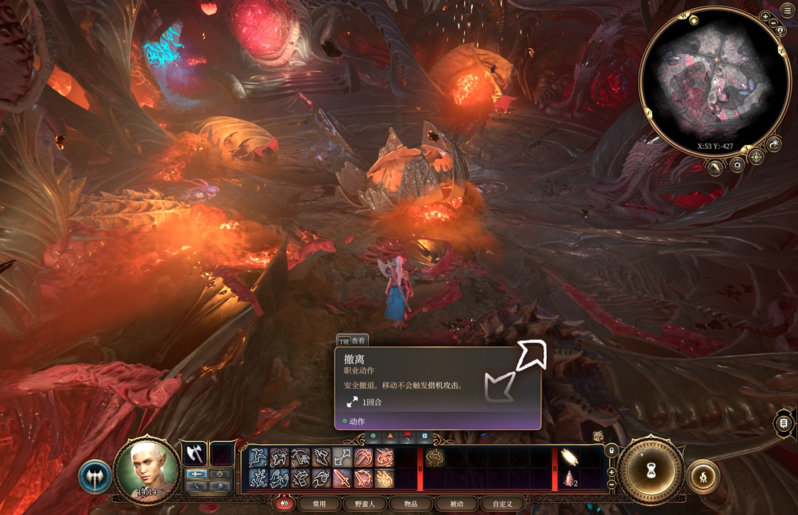

# v1.0.1 validation / 验证记录

## English

Validated on 12 September 2026 with an Apple M4 Pro, macOS 27, and native arm64 Steam BG3 **4.1.1.7398727**, at **3456 × 2234** output. This covers rendering, installation and a short capped-load comparison on one machine; it is not an uncapped FPS benchmark or a compatibility guarantee for other builds.

### Live game

- Loaded an existing Nautiloid save and observed the character, fire, environment and HUD rendering at Ultra Quality and Performance. The final installed payload was separately launched through Steam and loaded the same save at Ultra Quality.
- The final installed injector registered **39 hooks, 0 misses**, created a **2304 × 1489 → 3456 × 2234** temporal scaler and logged successful GPU completion beyond frame 4,500. It ran with tracing disabled and no companion test `.metallib` file.
- Live render-target changes matched all four modes: Ultra Quality **2304 × 1489**, Quality **2032 × 1314**, Balanced **1728 × 1117**, Performance **1175 × 759**. Quality and Balanced were checked in the menu; Ultra Quality and Performance were also checked in the loaded save. Off with TAA switched to **3456 × 2234** temporal anti-aliasing.
- The Simplified Chinese settings displayed **MetalFX** and its description. The PAK contains the module manifest and 15 language XML files, each with the two expected string handles at version 2. Other languages were structurally checked, not individually checked in game.
- The game exited normally and retained the mod registration. The original graphics settings were restored and compared byte for byte. No manual save was made.



The existing **10 FPS limit** was preserved. GPU command-buffer durations include surrounding game work and are not MetalFX-only timings. These checks do not establish an uncapped FPS improvement, motion-quality superiority, full camera-cut handling, or coverage of every scene/effect. Intel/Rosetta, HDR display output, split-screen, multiplayer and other Macs were not tested.

### GPU load with the existing 10 FPS cap

Measured with [macmon 0.8.2](https://github.com/vladkens/macmon), without sudo. Each mode ran for 90 one-second samples; the first 30 were discarded and the remaining 60 averaged. Order: MetalFX Ultra Quality, matched-resolution FSR 1.0, native TAA. The same loaded save, stationary camera, output size and frame cap were used; no builds or UI automation ran during each sampling window.

| Mode | GPU active time | Frequency-scaled active ratio | Mean GPU clock | GPU power | GPU temperature |
|---|---:|---:|---:|---:|---:|
| Native TAA, upscaling Off | 93.1% | 23.9% | 406 MHz | 3.03 W | 65.0°C |
| FSR 1.0, matched 1.5× factor | 33.9% | 18.4% | 854 MHz | 3.67 W | 63.6°C |
| MetalFX Ultra Quality, 1.5× | 36.9% | 22.7% | 970 MHz | 3.61 W | 65.5°C |

The FSR control disabled `BG3MF_TEMPORAL` while retaining the 1.5× scale patch, so its input matched MetalFX's 2304 × 1489. It is not stock FSR's identically named Ultra Quality preset (1.3×). Native TAA used upscaling Off with the temporal bridge disabled; that state was checked in the video settings after sampling. The localization label remained installed in the controls and did not indicate whether the bridge was enabled.

**Lower active-time occupancy did not establish lower power or heat.** MetalFX spent less time active than native rendering, but at a higher clock; measured GPU power was slightly higher, not lower. At equal input resolution, FSR and MetalFX power were close and MetalFX's active ratio was higher. Do not convert these occupancy percentages into an FPS speedup.

These are whole-GPU readings, including other applications, from one sequential run per mode. The 10 FPS setting was preserved; delivered frame rate was not separately instrumented for every control. Small HUD tooltip differences were present. Temperature depends on earlier load and fan response; fan 0 averaged about 1353–1356 RPM. Two power traces contained a zero/doubled reading pair, consistent with counter-update timing, so raw samples were retained and window means reported. This is not a long-duration thermal equilibrium or general energy-efficiency claim. Original graphics settings and the normal MetalFX launch environment were restored after testing.

### Rendering regressions

The bridge simulator uses known green HDR input and checks the resulting pixels, including the original RCAS inverse-compression pass and a downstream consumer in the **same compute encoder**. It exercises both compute-encoder creation selectors and both dispatch variants. The injector was also copied alone into a directory without a test shader library; default viewport filtering and tracing-off behavior were used.

| Path / factor | Pixels matching the expected color | Result |
|---|---:|---|
| Ultra Quality / 1.5 | 2040 / 2040 | PASS |
| Quality / 1.7 | 2652 / 2652 | PASS |
| Balanced / 2.0 | 3600 / 3600 | PASS |
| Performance / 2.9411765 | 7906 / 7906 | PASS |
| Native TAA, with unused FSR pipeline objects present | 920 / 920 | PASS |

The independent temporal smoke test passed stationary, translated, and translated-with-reset cases, with no NaNs; final reported mean absolute errors were **0.0004**, **0.0018**, and **0.0018**. Synthetic motion checks are separate from the live-game screenshots.

### Installer and artifacts

- Isolated fixture tests passed installation/uninstallation, repeat installation, preservation of existing launch arguments, migration from quoted and unquoted v1 developer wrappers, preservation of other games and later unrelated edits, and removal of only this mod's registrations.
- Invalid payloads and malformed XML were rejected before configuration writes. Uninstall refused to overwrite a subsequently edited BG3 launch option and kept the launcher available.
- The PKG was expanded and its exact `postinstall`/native payload executed **as the logged-in non-root user** on the reference machine. Real uninstall and reinstall passed; installed binary SHA-256 hashes matched the package payload. The final installed runtime was then verified in the game.
- The PKG declares arm64 and macOS 13+, and its component version is 1.0.1. Runtime binaries are ad-hoc signed. The PKG is unsigned. The ZIP includes the native installer, localization PAK, uninstall script and bilingual documentation; it contains no AppleDouble or `__MACOSX` entries.
- **The macOS Installer authorization GUI and its root-to-user dispatch branch were not exercised.** The ZIP runs the tested native helper directly. Other machines, fresh macOS installations and every Steam library/profile arrangement remain untested.

### Reproduce the local tests

From the repository root on an Apple Silicon Mac with CMake, Python 3 and Apple's Metal compiler tools:

```sh
cmake -S src -B src/build -DCMAKE_OSX_ARCHITECTURES=arm64
cmake --build src/build
./src/build/bg3mf_temporal_smoke
mkdir -p .validation/runs
for factor in 1.5 1.7 2.0 2.9411765; do
  DYLD_INSERT_LIBRARIES="$PWD/src/build/libbg3mf_probe.dylib" \
  BG3MF_HOME="$PWD/.validation" BG3MF_TEMPORAL=1 \
  BG3MF_OBSERVER_DELAY_MS=0 SMOKE_START_DELAY_MS=1500 \
  SIM_FSR=1 SIM_SCALE="$factor" ./src/build/bg3mf_temporal_bridge_sim
done
DYLD_INSERT_LIBRARIES="$PWD/src/build/libbg3mf_probe.dylib" \
BG3MF_HOME="$PWD/.validation" BG3MF_TEMPORAL=1 \
BG3MF_OBSERVER_DELAY_MS=0 SMOKE_START_DELAY_MS=1500 \
SIM_CREATE_FSR_ONLY=1 ./src/build/bg3mf_temporal_bridge_sim
bash scripts/build_pkg.sh
unzip -q dist/BG3-MetalFX-arm64.zip -d .validation
python3 src/tests/test_installer.py src/build/bg3mf_installer .validation/BG3-MetalFX-arm64
```

Expected final markers are `SMOKE_RESULT PASS`, `BRIDGE_SIM_RESULT PASS`, and `INSTALLER_TESTS PASS`. Fixture tests use temporary homes and do not change real Steam profiles. A successful synthetic test does not replace launching the actual game.

---

## 简体中文

验证日期为 2026 年 9 月 12 日，设备为 Apple M4 Pro、macOS 27，游戏为原生 arm64 Steam 版 BG3 **4.1.1.7398727**，输出分辨率 **3456 × 2234**。本轮覆盖单台设备上的渲染、安装与短时限帧负载对照，不是无限帧率性能基准，也不保证其他版本兼容。

### 实机游戏

- 载入已有的鹦鹉螺存档，验证 Ultra Quality 和 Performance 下的角色、火焰、环境与 HUD 正常显示。随后通过 Steam 单独启动最终安装包中的程序，以 Ultra Quality 再次载入同一存档。
- 最终安装版注册 **39 个 hook，0 个缺失**，创建 **2304 × 1489 → 3456 × 2234** 时序缩放器，成功完成 GPU 渲染的日志超过第 4,500 帧。默认关闭详细追踪，安装目录中没有测试用 `.metallib` 文件。
- 四档实际输入尺寸均已在游戏中观察到：Ultra Quality **2304 × 1489**、Quality **2032 × 1314**、Balanced **1728 × 1117**、Performance **1175 × 759**。Quality 与 Balanced 在菜单中验证；Ultra Quality 与 Performance 还在载入的存档中验证。关闭超分辨率并保留 TAA 后，切换到 **3456 × 2234** 的时序抗锯齿。
- 简体中文设置显示 **MetalFX** 及其说明。PAK 包含模块清单与 15 种语言 XML，每份均含两个预期的字符串句柄，版本为 2。其他语言仅做结构检查，未逐一进入游戏验证。
- 游戏正常退出后 mod 注册仍然保留。原始图形设置已恢复并逐字节比对一致。测试未手动保存游戏。

上方截图来自最终安装版的 Ultra Quality 实机场景。保留了用户原有的 **10 FPS 上限**。GPU 命令缓冲区耗时包含同一缓冲区内的游戏工作，不能当作 MetalFX 独立耗时。本轮验证不证明无限帧率下的性能提升、运动画质优越性、完整的镜头切换重置或全部场景特效兼容。Intel/Rosetta、HDR 显示输出、分屏、多人模式和其他 Mac 未测试。

### 保留 10 FPS 上限的 GPU 负载对照

使用 [macmon 0.8.2](https://github.com/vladkens/macmon) 无 sudo 采样。每组每秒读取一次，共 90 次，丢弃前 30 次，取后 60 次平均。顺序为 MetalFX Ultra Quality、同输入尺寸 FSR 1.0、原生 TAA。使用同一存档、固定镜头、相同输出尺寸与帧率上限；采样窗口内没有编译或 UI 自动操作。

| 模式 | GPU 活跃时间占比 | 按频率加权占比 | 平均 GPU 频率 | GPU 功耗 | GPU 温度 |
|---|---:|---:|---:|---:|---:|
| 原生 TAA，关闭超分 | 93.1% | 23.9% | 406 MHz | 3.03 W | 65.0°C |
| FSR 1.0，同为 1.5× | 33.9% | 18.4% | 854 MHz | 3.67 W | 63.6°C |
| MetalFX Ultra Quality，1.5× | 36.9% | 22.7% | 970 MHz | 3.61 W | 65.5°C |

FSR 对照仅关闭 `BG3MF_TEMPORAL`，保留 1.5× 比例补丁，使输入与 MetalFX 的 2304 × 1489 一致，不是原版 FSR 同名的 Ultra Quality 档（1.3×）。原生 TAA 对照关闭超分与时序桥接，采样后在视频设置中确认该状态。对照组仍保留本地化文字，因此标签本身不能证明桥接已启用。

**活跃时间占比降低，不能证明功耗和发热降低。** 相比原生渲染，MetalFX 的 GPU 活跃时间更短，但运行频率更高，本轮 GPU 功耗略高而非更低。同输入尺寸下，FSR 与 MetalFX 功耗接近，而 MetalFX 活跃占比更高。不要把占用百分比换算成帧率提升倍数。

以上是整颗 GPU 的读数，含其他应用影响，每种模式仅一次顺序测试。始终保留 10 FPS 设置，未分别对每个对照组另行采集实际交付帧率。HUD 提示框有轻微差异。温度受前序负载和风扇响应影响，风扇 0 平均约 1353–1356 RPM；两组功耗中各有零值/双倍值的相邻读数，与计数器更新时序相符，因此保留原始数据并报告窗口均值。本轮不构成长时间热平衡或普遍能效提升结论。测试后已恢复原始图形设置与正常 MetalFX 启动环境。

### 渲染回归

模拟器使用已知的绿色 HDR 输入，检查经过原始 RCAS 逆压缩及**同一 compute encoder 内下游消费者**后的像素结果，覆盖两种 compute encoder 创建接口和两种 dispatch 接口。另将 dylib 单独复制到不含测试着色器库的目录，以默认视口过滤、默认关闭追踪的配置运行。

上表五项均通过：四档分别为 **2040/2040、2652/2652、3600/3600、7906/7906** 个像素符合预期；已创建但未使用 FSR 管线对象时，原生 TAA 路径为 **920/920**。独立时序烟雾测试的静止、平移、平移并重置三项也均通过，无 NaN，最终平均绝对误差分别为 **0.0004、0.0018、0.0018**。合成运动测试与实机截图属于不同证据。

### 安装与产物

- 隔离测试通过安装/卸载、重复安装、保留已有启动参数、迁移带引号和不带引号的 v1 开发路径、保留其他游戏及后续无关修改、仅移除自身 mod 注册等用例。
- 无效载荷和损坏 XML 在写配置前被拒绝。用户后来改动 BG3 启动项时，卸载器拒绝覆盖并保留启动器。
- 已展开 PKG，将包内原样的 `postinstall` 和原生程序以**当前登录的非 root 用户**在本机执行。实际卸载、重装均成功；安装后二进制 SHA-256 与包内一致，随后使用这份最终安装版进入游戏验证。
- PKG 声明 arm64、macOS 13+，组件版本 1.0.1。二进制使用 ad-hoc 签名，PKG 未签名。ZIP 包含原生安装器、语言 PAK、卸载脚本和双语文档，不含 AppleDouble 或 `__MACOSX` 条目。
- **未实测 macOS Installer 的授权界面及其 root 转用户调度分支。** ZIP 直接运行已测试的原生安装器。其他设备、全新 macOS 环境以及所有 Steam 库和档案布局仍未覆盖。

### 复现

在 Apple Silicon Mac 安装 CMake、Python 3 和 Apple Metal 编译工具后，于仓库根目录运行上方命令。预期末尾标记为 `SMOKE_RESULT PASS`、`BRIDGE_SIM_RESULT PASS` 和 `INSTALLER_TESTS PASS`。隔离安装测试使用临时主目录，不修改真实 Steam 档案。合成测试通过不能替代实际启动游戏验证。
